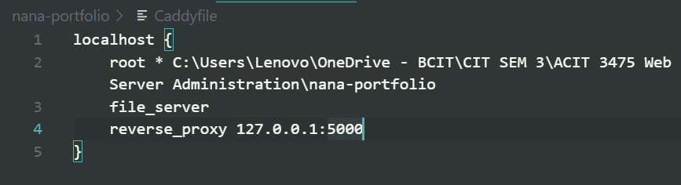

# Part 2: Local Deployment and Portfolio Setup

## Step 1: Installing Caddy Locally
1. Install Caddy on your local machine (Windows, Linux, or Mac).
   - For Windows, download the installer from the [Caddy GitHub Page](https://github.com/caddyserver/caddy/releases) or go to the [Caddy website](https://caddyserver.com/docs/install) for installation instructions.

2. Verify the installation by running the following command in your terminal or command prompt:
    ```
    caddy --version
    ```
This command should return the version of Caddy you have installed. If it does, congratulations! You have successfully installed Caddy on your local machine.

[Successful Download](..\assets\caddy--version.png)

## Step 2: Building the Portfolio Website
### Frontend:
1. Create a visually appealing website with the following sections:
   - **Projects**: Showcase at least two completed projects with detailed descriptions and visuals.
   - **Resume**: Include a professional resume section.
2. Use **HTML**, **CSS**, and **JavaScript** to design and implement the frontend.

### Backend:
1. Develop a backend using **Flask** or **Express.js** to handle:
   - **Login functionality**: Allow users to log in securely.
   - **Session management**: Manage user sessions effectively.

## Step 3: Configuring Caddy to Serve Locally

1. Write a `Caddyfile` to serve the portfolio website locally. Below is an example configuration:
    ```plaintext
    # Caddyfile
    localhost {
        reverse_proxy /api localhost:5000
    }
    ```
    - **`root`**: Specifies the directory containing your website's static files.
    - **`file_server`**: Serves static files (HTML, CSS, JavaScript).
    - **`reverse_proxy`**: Proxies API requests to the backend server (e.g., Flask running on port 5000).

    This is how my `Caddyfile` looks like:
        

2. Save the `Caddyfile` in the root directory of your project.
3. Start the portfolio website by running ```python app.py``` in the terminal. This will start the backend server (Flask or Express.js) on port 5000.
    - Ensure that your backend server is running before starting Caddy.

4. Start the Caddy server by running:
    ```
    caddy run
    ```
    This will serve your portfolio website locally at `http://localhost`.

[Previous](../part1/caddy.md) | [Next](/..part3/deployment-aws.md) | [Back to Home](../README.md)