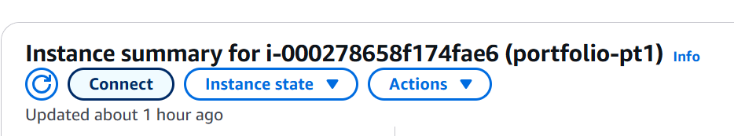
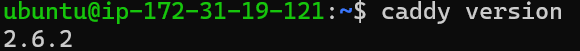
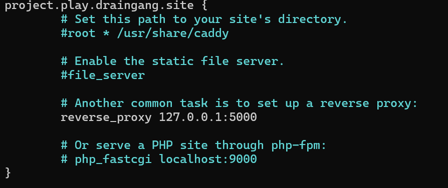
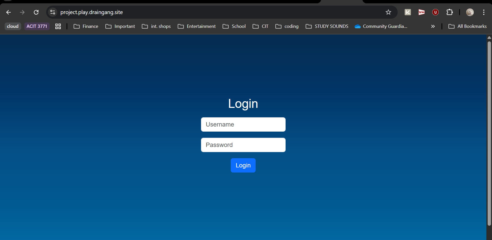

# Part 3: Cloud Deployment and Domain Setup

## Step 1: Setting Up a Cloud Instance
1. Log in to your AWS Management Console.
2. Navigate to the EC2 dashboard and click "Launch Instance."
3. Choose an Amazon Machine Image (AMI), such as Ubuntu Server 20.04 LTS.
4. Select an instance type (e.g., t2.micro for free tier eligibility).
5. Configure instance details, such as network settings and security groups.
6. Add storage and tags as needed, then review and launch the instance.
7. Download the private key file (.pem) for SSH access.

This is the instance I have made for this part of the project:


## Step 2: Installing Caddy on the Cloud Instance
1. SSH into your cloud instance using the private key:
   ```bash
   ssh -i your-key.pem ubuntu@<your-instance-public-ip>
    ```
    Replace `your-key.pem` with the path to your private key file and `<your-instance-public-ip>` with the public IP address of your instance.  
2. Install Caddy on the cloud instance:
   ```bash
   sudo apt update
   sudo apt install -y caddy
   ```
3. Verify the installation by running:
   ```bash  
    caddy version
    ```
    This command should return the version of Caddy installed on your cloud instance.
    Here is the confirmation of the installed version:
        

## Step 3: Domain Name and HTTPS Setup
1. After purchasing a domain name, log in to your domain registrar's control panel.
2. Create an A record pointing your domain to the public IP address of your cloud instance.
Since I already have a AWS Route53 domain, I will use that for the domain name setup.
3. Create a Caddyfile in `/etc/caddy/Caddyfile` with the following content:
   ```caddyfile
   your-domain.com {
       reverse_proxy localhost:5000
   }
   ```
   In my case, I will use `play.draingang.site` as the domain name.
   Below this is how my config file looks like:
   

4. Start Caddy to apply the configuration:
   ```bash
    sudo systemctl start caddy
    sudo systemctl enable caddy

Test the setup by visiting your domain in a web browser. You should see the application running with HTTPS enabled.

I visited my website ```https://project.play.draingang.site/``` and it welcomes me with the login page:


[Previous](../part2/installing-caddy.md) | [Back to Home](../README.md)